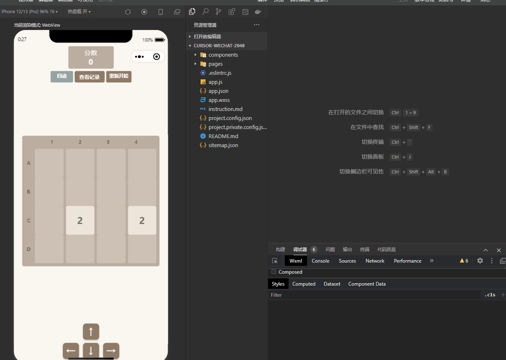

# 2048 记谱版

一个支持记录移动步骤的 2048 小游戏，基于微信小程序开发。

## 开发说明

本项目是通过 [Cursor](https://cursor.sh/) AI 编程助手开发完成的实验性项目。整个开发过程中：
- 所有代码均由 AI 生成并迭代优化
- 人工仅参与需求描述和功能验证
- 展示了 AI 辅助编程的能力和潜力

## 功能特点

### 基础玩法
- 经典的 2048 游戏规则
- 支持触摸滑动和方向键操作
- 支持选中单个数字进行移动
- 响应式布局，适配各种屏幕尺寸

### 创新功能
- 棋盘坐标系统 (A1-D4)
- 详细的移动记录
  - 记录每步移动的起始位置
  - 显示移动方向
  - 记录合并结果和得分
- 支持撤回操作
- 智能自动模式
  - 自动寻找有效移动
  - 避免重复无效移动
  - 详细的停止原因提示





## 开发过程

1. 需求阶段
   - 向 AI 描述基础的 2048 游戏需求
   - 逐步添加记谱、自动模式等创新功能
   - 提出界面优化和适配需求

2. 开发阶段
   - AI 生成初始代码框架
   - 根据测试反馈进行代码优化
   - 解决界面适配等具体问题
   - 优化用户体验细节

3. 迭代优化
   - 基于实机测试反馈
   - 解决布局适配问题
   - 优化自动模式逻辑
   - 完善错误处理机制

## 项目意义

1. 技术探索
   - 验证 AI 辅助编程的可行性
   - 展示 AI 在游戏开发中的应用
   - 测试 AI 处理复杂逻辑的能力

2. 开发效率
   - 大幅减少人工编码时间
   - 快速实现功能迭代
   - 保持代码质量和可维护性

## 界面预览

- 顶部显示分数和操作按钮
- 中间是带坐标的游戏棋盘
- 底部是方向控制键
- 可切换显示移动记录面板

## 技术特点

- 使用 flex 布局实现响应式设计
- 优化的动画效果
- 完整的状态管理
- 细致的错误处理
- 支持小屏幕适配

## 使用说明

1. 打开微信开发者工具
2. 导入项目
3. 编译运行即可

## 操作方式

- 滑动：手指滑动屏幕
- 方向键：点击屏幕底部的方向按钮
- 选择模式：点击数字后使用方向键
- 自动模式：点击"自动"按钮

## 不足之处
1. 自动模式处理情况单一,不能持续进行
2. 撤回操作不能完全返回上一步准确局面


## 开发环境

- 微信开发者工具
- 基础库版本：最新版本
- 项目类型：小程序

## 代码结构
```
2048-notation/
├── pages/
│   ├── game/
│   │   ├── game.js
│   │   ├── game.wxml
│   │   └── game.wxss
│   └── index/
│       ├── index.js
│       ├── index.wxml
│       └── index.wxss
├── app.js
├── app.json
├── app.wxss
├── project.config.json
├── project.private.config.json
├── sitemap.json
└── README.md
```


### 核心文件说明

1. **首页 (index)**
   - `index.wxml`: 简洁的开始界面
   - `index.wxss`: 首页样式定义
   - `index.js`: 处理游戏启动逻辑

2. **游戏页面 (game)**
   - `game.js`: 
     - 游戏核心算法
     - 数据状态管理
     - 移动和合并逻辑
     - 自动模式实现
     - 记录系统实现
   
   - `game.wxml`:
     - 分数显示区
     - 功能按钮组
     - 移动记录面板
     - 带坐标的游戏棋盘
     - 方向控制按钮
   
   - `game.wxss`:
     - Flex 布局实现
     - 动画效果定义
     - 响应式样式
     - 主题色定义

3. **全局配置**
   - `app.json`: 小程序配置
   - `app.wxss`: 全局样式定义
   - `project.config.json`: 项目配置信息

### 特点说明

- 采用模块化结构
- 清晰的代码组织
- 良好的注释说明
- 便于维护和扩展

## 致谢

特别感谢 [Cursor](https://cursor.sh/) AI 编程助手在本项目开发过程中提供的强大支持。

## 许可证

MIT License

## 作者

[Your Name]

注：本项目代码由 AI 生成，人工参与需求描述和功能验证。 